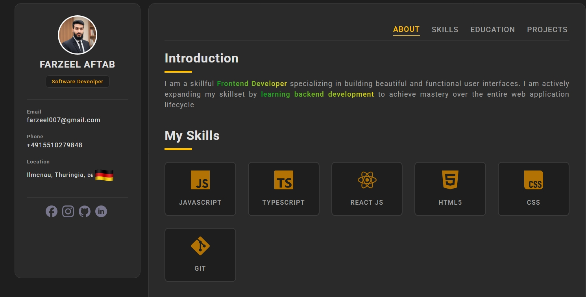

---

# **Personal Portfolio Website**

A modern and responsive **portfolio website** built using **HTML, CSS, and JavaScript**.
This portfolio showcases personal details, skills, education, and featured projects in a clean and organized layout.
It is fully responsive and includes a mobile-friendly navigation bar.

---

## **📌 Features**

### 🔹 **Beautiful UI Layout**

* Clean left-side profile section
* Right-side content section with smooth navigation
* Minimal and modern UI using Roboto font

### 🔹 **Sections Included**

* **About Me** – Short introduction and role
* **Skills** – Displayed using a dynamic grid
* **Education Timeline** – Modern vertical timeline
* **Projects Section** – Project cards with tech filters
* **Contact / Social Media Links**

### 🔹 **Responsive Design**

* Desktop navigation bar
* Mobile bottom navigation bar for better usability

### 🔹 **Reusable Script Structure**

* Skills, projects, and education are dynamically rendered using `script.js`
* Easy to update content without touching HTML structure

---

## **📁 Folder Structure**

```
├── index.html
├── style.css
├── script.js
├── profile.png
├── germany.png
├── linkedIn.svg
├── preview.jpeg
└── README.md
```

---


## **🛠️ Technologies Used**

* **HTML5**
* **CSS3**
* **JavaScript (ES Modules)**
* Google Fonts
* SimpleIcons SVG Icons

---

## **📸 Preview**

You can add a preview screenshot here later:

```


```

---

## **📌 Customization**

You can easily customize:

### ✔ Name, email, phone

Modify inside the **leftSide** section in `index.html`.

### ✔ Skills, education, projects

All dynamic content can be updated in `script.js`.

### ✔ Theme colors

Update color values inside `style.css`.

---

## **📬 Contact**

Feel free to connect:

* **GitHub:** [https://github.com/Farzeel](https://github.com/Farzeel)
* **LinkedIn:** [https://www.linkedin.com/in/farzeel-aftab-2568a727b/](https://www.linkedin.com/in/farzeel-aftab-2568a727b/)
* **Instagram:** [https://instagram.com/farzeel07](https://instagram.com/farzeel07)

---


